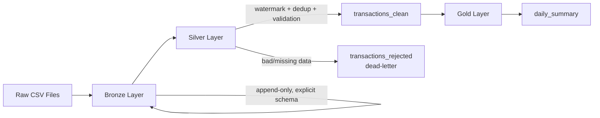

# Retail CDC Pipeline

A batch data pipeline built on Databricks demonstrating **incremental (CDC-style) loading**, **deduplication**, **schema evolution handling**, and the **dead-letter pattern** — using the Medallion (Bronze/Silver/Gold) architecture with Delta Lake and Unity Catalog.

Built as a hands-on portfolio project to move beyond ETL *conversion* work into real pipeline *design* — every decision below was made deliberately, debugged from a real error, and can be explained end-to-end.

---

## Architecture



| Layer | Table | Purpose |
|---|---|---|
| **Bronze** | `bronze.raw_transactions` | Faithful, append-only copy of raw source data — no cleaning, no filtering |
| **Silver** | `silver.transactions_clean` | Validated, deduplicated, incrementally merged business data |
| **Silver** | `silver.transactions_rejected` | Dead-letter table — bad rows, tagged with rejection reason |
| **Gold** | `gold.daily_summary` | Business-ready daily aggregation |

---

## Why This Project

Most ETL tickets in a services-company job involve *converting* existing logic (e.g., ADF → PySpark) rather than *designing* a pipeline from scratch. This project was built to close that gap — every design decision here has an explicit reason, documented below, so it can be defended in an interview rather than just described.

---

## Key Design Decisions

### Why explicit schemas instead of `inferSchema=True`?
Inferred schemas can silently change between runs depending on the data sample (e.g., a numeric column becomes a string if one row has a typo). Explicit `StructType` schemas make the pipeline predictable and fail loudly on genuinely malformed input.

### Why Delta Lake over plain Parquet?
ACID transactions (no partial/corrupt writes on failure), native `MERGE INTO` support (needed for incremental upserts), schema enforcement + controlled evolution via `mergeSchema`, and time travel for debugging.

### Why watermark-based incremental load instead of full reprocessing?
At real data volumes, reprocessing all history every run doesn't scale — cost and runtime grow with total data size, not just new data. Watermarking (tracking the max `updated_at` already processed) means each run only touches what's new.

### Why deduplicate before MERGE?
`MERGE INTO` throws `DELTA_MULTIPLE_SOURCE_ROW_MATCHING_TARGET_ROW_IN_MERGE` if the source batch has multiple rows for the same key — Spark can't resolve which one should win. This happens in real systems when upstream resends or corrects a record. Resolved deterministically using `ROW_NUMBER()` over a window, keeping the latest row per key.

### Why split out timestamp-missing rows *before* the watermark filter?
A subtle, real bug found while building this: SQL's `null > value` evaluates to `null`, not `false`. A row with a null/unparseable `updated_at` would silently vanish from the pipeline — not reaching Silver, not reaching the dead-letter table — if the watermark filter ran before validating timestamps. Fixed by explicitly separating "no valid timestamp" rows first and routing them straight to dead-letter.

### Why a dead-letter table instead of failing the whole job on bad data?
One malformed row shouldn't block every valid row in the batch. Rejected rows are tagged with a specific reason (`missing_required_field`, `unparseable_or_missing_timestamp`) and written to a separate table — visible and fixable, not silently dropped and not blocking the pipeline.

### Why `try_cast` / `try_to_timestamp` instead of `cast` / `to_timestamp`?
Under ANSI SQL mode, plain `cast()` and `to_timestamp()` throw hard errors on any malformed value, crashing the entire job over one bad row. The `try_` variants return `null` on failure instead, letting bad values flow safely into the existing validation/dead-letter logic rather than taking down the run.

### Why `coalesce()` across multiple timestamp formats?
Real upstream data isn't consistently formatted — this project's raw data mixes ISO (`yyyy-MM-dd HH:mm:ss`) and `dd-MM-yyyy HH:mm` formats across batches. `coalesce()` tries each format in order per row; the first successful parse wins, and genuinely unparseable values still fall through to `null` → dead-letter.

### Why does Gold use full overwrite, not incremental logic?
Gold aggregates are cheap to recompute since they read from the already-small, already-clean Silver table. Incremental complexity is only worth it where the underlying data volume is large (Bronze → Silver) — adding it to Gold too would be complexity without benefit.

### Why is Bronze's schema more permissive than Silver's?
Bronze's job is faithful capture, not gatekeeping — rejecting or reshaping data belongs at Silver. A new column appearing in a raw file (schema evolution) shouldn't break ingestion; strict validation happens downstream where it's actually meaningful.

### Why is all config externalized to `config.yaml`?
No table names, paths, or parameters are hardcoded inside pipeline logic. Moving from a personal dev catalog to a team/prod catalog should only ever require a config change, never a code change.

### Why idempotency by filename *and* file-modification-time, not filename alone?
A source system reusing a filename with new content (e.g., a repeatedly-overwritten `latest_orders.csv`) would be silently skipped by filename-only tracking. Tracking `_metadata.file_modification_time` alongside the path correctly treats same-named-but-changed files as new.

---

## Real Bugs Hit & Fixed (while building this)

| Bug | Root Cause | Fix |
|---|---|---|
| `DELTA_MULTIPLE_SOURCE_ROW_MATCHING_TARGET_ROW_IN_MERGE` | Source batch had duplicate keys | Dedup via `ROW_NUMBER()` window function before MERGE |
| Rows silently missing from both Silver and dead-letter | `null > watermark` evaluates to `null`, filtering out null-timestamp rows invisibly | Split timestamp-valid vs. missing rows *before* the watermark filter |
| `CANNOT_PARSE_TIMESTAMP` on mixed-format dates | ANSI mode's `to_timestamp()` throws on any format mismatch | Switched to `try_to_timestamp()` + `coalesce()` across known formats |
| RDD not supported on serverless compute | Used `.rdd.flatMap()` for idempotency check | Rewrote using plain DataFrame `.collect()` |
| Dead-letter table missing rows despite correct log count | Write statement used `rejected_df` instead of the unioned `all_rejected_df` | Fixed write to use the combined rejected DataFrame |
| Deduplication kept the *oldest* row, not newest | Window `orderBy()` was ascending by default | Added `.desc()` to keep the most recent version per key |

---

## Project Structure

```
retail-cdc-pipeline/
├── src/
│   ├── schemas.py              # Explicit StructType schemas (Bronze, Silver)
│   ├── utils.py                 # Logger, config loader, table_exists helper
│   ├── bronze_ingest.py         # Raw, append-only, idempotent ingestion
│   ├── silver_incremental.py    # Core: watermark, dedup, validation, MERGE
│   └── gold_aggregate.py        # Simple daily business summary
├── notebooks/
│   └── demo.py                  # End-to-end pipeline runner (Databricks notebook format)
├── config/
│   └── config.yaml              # All table names, paths, and parameters
└── README.md
```

---

## Tech Stack

- **Databricks** (Serverless Compute)
- **PySpark** / Spark SQL
- **Delta Lake** (ACID transactions, `MERGE INTO`, schema evolution)
- **Unity Catalog** (catalog/schema/table governance)
- **Python** (config-driven, modular, unit-testable structure)

---

## How to Run

1. Clone this repo into a Databricks Git folder (Repos).
2. Update `config/config.yaml` with your catalog/schema names and raw file landing path.
3. Create the Bronze/Silver/Gold schemas in Unity Catalog matching your config.
4. Upload a batch CSV to the configured `raw_file_path`.
5. Run `notebooks/demo.py` top to bottom — it calls Bronze → Silver → Gold in sequence and displays results, including any dead-letter rows.

---

## Test Scenarios Covered

| Scenario | What It Proves |
|---|---|
| Clean batch load | Bronze → Silver → Gold flows end-to-end |
| Re-running the same file | Idempotency — no duplicate Bronze rows |
| Batch with duplicate keys | MERGE dedup logic resolves ambiguous matches correctly |
| Batch with a new column | Schema evolution handled without breaking ingestion |
| Batch with missing required fields | Dead-letter routing, tagged with reason |
| Batch with unparseable/missing timestamps | Rows are caught and routed to dead-letter, not silently dropped |
| Batch with mixed date formats | `coalesce()` across formats correctly parses both |

---

## What Would Change at 10x Data Volume

1. **Reprocessing logic** — already addressed by the watermark design from the start.
2. **Partitioning** — Bronze/Silver tables would need date-based partitioning (not applied at this small scale) to avoid full-table scans.
3. **Cluster sizing** — the easiest lever, since Databricks scales horizontally; addressed last, not first.

---

## Author's Note

This project was built iteratively, hitting and fixing real errors along the way rather than following a pre-written script — the bug log above is a genuine record of that process, not a synthetic example.
