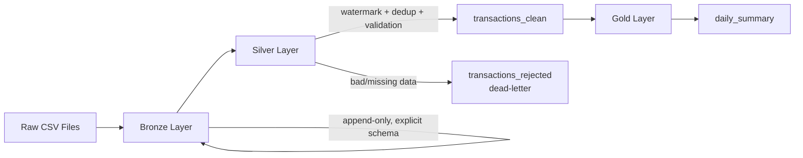

# Retail CDC Pipeline

A batch data pipeline built on Databricks demonstrating **incremental (CDC-style) loading**, **deduplication**, **schema evolution handling**, and the **dead-letter pattern** — using the Medallion (Bronze/Silver/Gold) architecture with Delta Lake and Unity Catalog.

Built as a hands-on portfolio project to move beyond ETL *conversion* work into real pipeline *design* — every decision below was made deliberately, debugged from a real error, and can be explained end-to-end.

---

## Architecture



| Layer | Table | Purpose |
|---|---|---|
| **Bronze** | `bronze.raw_transactions` | Faithful, append-only copy of raw source data — no cleaning, no filtering |
| **Silver** | `silver.transactions_clean` | Validated, deduplicated, incrementally merged business data |
| **Silver** | `silver.transactions_rejected` | Dead-letter table — bad rows, tagged with rejection reason |
| **Gold** | `gold.daily_summary` | Business-ready daily aggregation |

---

## Why This Project

Most ETL tickets in a services-company job involve *converting* existing logic (e.g., ADF → PySpark) rather than *designing* a pipeline from scratch. This project was built to close that gap — every design decision here has an explicit reason, documented below, so it can be defended in an interview rather than just described.

---
## Key Design Decisions

- **Explicit schemas, not `inferSchema`** — predictable behavior, fails loudly on bad input instead of silently guessing types.
- **Delta Lake over Parquet** — ACID transactions, native `MERGE`, schema evolution, time travel.
- **Watermark-based incremental load** — only processes new data each run, not full history.
- **Dedup before MERGE** — resolves ambiguous duplicate-key matches using `ROW_NUMBER()`, keeping the latest row per key.
- **Timestamp validity checked before the watermark filter** — prevents null-timestamp rows from silently vanishing (`null > value` = `null`, not `false`).
- **Dead-letter table for bad data** — bad rows are tagged and quarantined, not dropped or allowed to crash the job.
- **`try_cast` / `try_to_timestamp`** — malformed values become `null` instead of failing the whole run.
- **`coalesce()` across date formats** — handles inconsistent formats from different upstream sources in one pass.
- **Gold uses full overwrite** — cheap to recompute from an already-clean Silver table; no incremental complexity needed here.
- **Bronze schema is permissive, Silver is strict** — Bronze's job is faithful capture, not gatekeeping; validation belongs downstream.
- **Config externalized to `config.yaml`** — moving environments is a config change, never a code change.
- **Idempotency by filename + modification time** — a reused filename with new content is still correctly treated as new data.

---
## Real Bugs Hit & Fixed (while building this)

| Bug | Root Cause | Fix |
|---|---|---|
| `DELTA_MULTIPLE_SOURCE_ROW_MATCHING_TARGET_ROW_IN_MERGE` | Source batch had duplicate keys | Dedup via `ROW_NUMBER()` window function before MERGE |
| Rows silently missing from both Silver and dead-letter | `null > watermark` evaluates to `null`, filtering out null-timestamp rows invisibly | Split timestamp-valid vs. missing rows *before* the watermark filter |
| `CANNOT_PARSE_TIMESTAMP` on mixed-format dates | ANSI mode's `to_timestamp()` throws on any format mismatch | Switched to `try_to_timestamp()` + `coalesce()` across known formats |
| RDD not supported on serverless compute | Used `.rdd.flatMap()` for idempotency check | Rewrote using plain DataFrame `.collect()` |
| Dead-letter table missing rows despite correct log count | Write statement used `rejected_df` instead of the unioned `all_rejected_df` | Fixed write to use the combined rejected DataFrame |
| Deduplication kept the *oldest* row, not newest | Window `orderBy()` was ascending by default | Added `.desc()` to keep the most recent version per key |

---

## Project Structure

```
retail-cdc-pipeline/
├── src/
│   ├── schemas.py              # Explicit StructType schemas (Bronze, Silver)
│   ├── utils.py                 # Logger, config loader, table_exists helper
│   ├── bronze_ingest.py         # Raw, append-only, idempotent ingestion
│   ├── silver_incremental.py    # Core: watermark, dedup, validation, MERGE
│   └── gold_aggregate.py        # Simple daily business summary
├── notebooks/
│   └── demo.py                  # End-to-end pipeline runner (Databricks notebook format)
├── config/
│   └── config.yaml              # All table names, paths, and parameters
└── README.md
```

---

## Tech Stack

- **Databricks** (Serverless Compute)
- **PySpark** / Spark SQL
- **Delta Lake** (ACID transactions, `MERGE INTO`, schema evolution)
- **Unity Catalog** (catalog/schema/table governance)
- **Python** (config-driven, modular, unit-testable structure)

---

## How to Run

1. Clone this repo into a Databricks Git folder (Repos).
2. Update `config/config.yaml` with your catalog/schema names and raw file landing path.
3. Create the Bronze/Silver/Gold schemas in Unity Catalog matching your config.
4. Upload a batch CSV to the configured `raw_file_path`.
5. Run `notebooks/demo.py` top to bottom — it calls Bronze → Silver → Gold in sequence and displays results, including any dead-letter rows.

---

## Test Scenarios Covered

| Scenario | What It Proves |
|---|---|
| Clean batch load | Bronze → Silver → Gold flows end-to-end |
| Re-running the same file | Idempotency — no duplicate Bronze rows |
| Batch with duplicate keys | MERGE dedup logic resolves ambiguous matches correctly |
| Batch with a new column | Schema evolution handled without breaking ingestion |
| Batch with missing required fields | Dead-letter routing, tagged with reason |
| Batch with unparseable/missing timestamps | Rows are caught and routed to dead-letter, not silently dropped |
| Batch with mixed date formats | `coalesce()` across formats correctly parses both |

---

## What Would Change at 10x Data Volume

1. **Reprocessing logic** — already addressed by the watermark design from the start.
2. **Partitioning** — Bronze/Silver tables would need date-based partitioning (not applied at this small scale) to avoid full-table scans.
3. **Cluster sizing** — the easiest lever, since Databricks scales horizontally; addressed last, not first.

---

## Author's Note

This project was built iteratively, hitting and fixing real errors along the way rather than following a pre-written script — the bug log above is a genuine record of that process, not a synthetic example.
